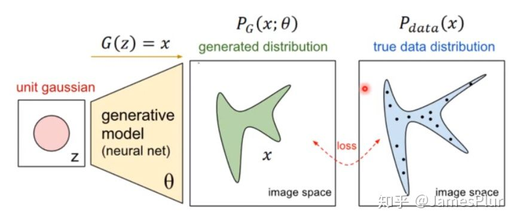
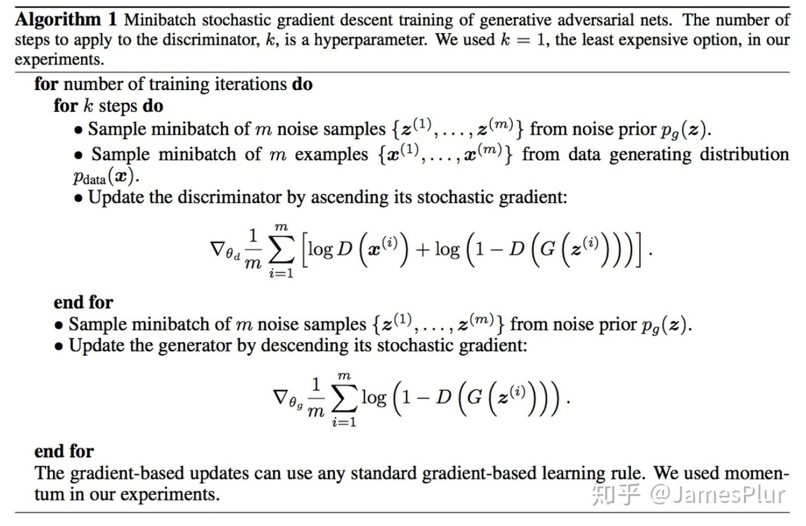
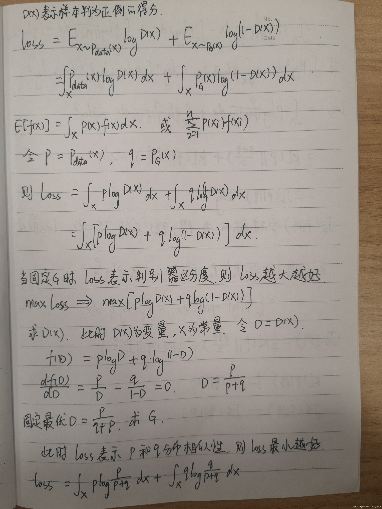

# GAN loss优化原理推导

理解生成对抗网络的关键在于理解GAN的损失函数

### JS散度

GAN实际是通过对先验分布施加一个运算G, 来拟合一个新的分布

如果从传统的判别式网络的思路出发，只要选定合适的loss，就可以使生成分布和真实分布之间的距离尽可能逼近

KL散度经常用来衡量分布之间距离

![[公式]](https://www.zhihu.com/equation?tex=D_%7BKL%7D%28P%7C%7CQ%29%3D%5Csum_%7Bx%5Cin+X%7DP%28x%29%5Clog%5Cfrac%7BP%28x%29%7D%7BQ%28x%29%7D)

但KL散度是不对称的。不对称意味着，对于同一个距离，观察方式不同，获取的loss也不同，那么整体loss下降的方向就会趋向于某个特定方向。这在GAN中非常容易造成模式崩塌，即生成数据的多样性不足

JS散度在KL散度的基础上进行了修正，保证了距离的对称性： 

![[公式]](https://www.zhihu.com/equation?tex=JS%28P%7C%7CQ%29+%3D+%5Cfrac%7B1%7D%7B2%7DKL%28P%7C%7C%5Cfrac%7BP%2BQ%7D%7B2%7D%29%2B%5Cfrac%7B1%7D%7B2%7DKL%28Q%7C%7C%5Cfrac%7BP%2BQ%7D%7B2%7D%29)

实际上，无论KL散度还是JS散度，在直接用作loss时，都是难以训练的：由于分布只能通过取样计算，这个loss在每次迭代时都几乎为零

### GAN loss的推导

GAN的训练方法，能够巧妙的解决这个问题：

先训练D，再训练G，二者相互对抗，直到收敛

在原始的GAN中，提出的loss是：

![[公式]](https://www.zhihu.com/equation?tex=%5Cmin_%7BG%7D%5Cmax_%7BD%7DV%28D%2CG%29%3DE_%7Bx+%5Cthicksim+p_%7Bdata%7D%28x%29%7D%5B%5Clog%7BD%28x%29%7D%5D%2BE_%7Bz%5Cthicksim+p_%7Bz%7D%28z%29%7D%5B%5Clog%7B%281-D%28G%28z%29%29%29%7D%5D)

当G固定且运算可逆时（实际上这一点一般不成立，但不影响了解GAN的思想）：

![[公式]](https://www.zhihu.com/equation?tex=E_%7Bz%5Cthicksim+p_%7Bz%7D%28z%29%7D%5B%5Clog%7B%281-D%28G%28z%29%29%29%7D%5D+%3D+E_%7Bx%5Cthicksim+p_%7BG%7D%28x%29%7D%5B%5Clog%7B%281-D%28x%29%29%7D%5D)

代入loss公式，进而有： 

![[公式]](https://www.zhihu.com/equation?tex=%5Cbegin%7Bsplit%7D++%26%5Cmax_%7BD%7DV%28D%2CG%29%5C%5C+%26%3D%5Cmax_%7BD%7DE_%7Bx+%5Cthicksim+p_%7Bdata%7D%28x%29%7D%5B%5Clog%7BD%28x%29%7D%5D%2BE_%7Bx%5Cthicksim+p_%7BG%7D%28x%29%7D%5B%5Clog%7B%281-D%28x%29%7D%5D%5C%5C+%26+%3D%5Cmax_%7BD%7D+%5Cint_%7Bx%7D+p_%7Bdata%7D%28x%29%5Clog%7BD%28x%29%7D%2Bp_g%28x%29%5Clog%7B%281-D%28x%29%29%7Ddx++%5C+%5Cend%7Bsplit%7D)

对于积分区间内的每一个x，设被积函数为f 为： 

![[公式]](https://www.zhihu.com/equation?tex=+f%28D%29+%3D+%7Bp_%7Bdata%7D%28D%29%5Clog%7By%7D%2Bp_g%28x%29%5Clog%7B%281-D%29%7D%7D+)

注意这里x是固定的，变量是D。对f求导，得到当 ![[公式]](https://www.zhihu.com/equation?tex=+f%28D%29+%3D+%7Bp_%7Bdata%7D%28D%29%5Clog%7By%7D%2Bp_g%28x%29%5Clog%7B%281-D%29%7D%7D+) 时，f存在最大值。

由于被积函数的最大值对于任意x都成立，所以当 ![[公式]](https://www.zhihu.com/equation?tex=D+%3D+%5Cfrac%7Bp_%7Bdata%7D%7D%7Bp_%7Bdata%7D%2Bp_%7BG%7D%7D) 时， V(D, G)有最大值

代入loss公式，有:

![[公式]](https://www.zhihu.com/equation?tex=%5Cbegin%7Balign%7D+%26%5Cmin_%7BG%7D%5Cmax_%7BD%7DV%28D%2CG%29%5C%5C+%26+%3D%5Cmin_%7BG%7D%5Cint_%7Bx%7D+p_%7Bdata%7D%28x%29%5Clog%7B%5Cfrac%7Bp_%7Bdata%7D%7D%7Bp_%7Bdata%7D%2Bp_%7BG%7D%7D%7D%2Bp_g%28x%29%5Clog%7B%28%5Cfrac%7Bp_%7BG%7D%7D%7Bp_%7Bdata%7D%2Bp_%7BG%7D%7D%29%7Ddx++%5C%5C+%26+%3D+-2log2+%2B+%5Cmin_%7BG%7D%5Cint_x+p_%7Bdata%7D%28x%29%5Clog%7B%5Cfrac%7Bp_%7Bdata%7D%7D%7B%28p_%7Bdata%7D%2Bp_%7BG%7D%29%2F2%7D%7D%2Bp_g%28x%29%5Clog%7B%28%5Cfrac%7Bp_%7BG%7D%7D%7B%28p_%7Bdata%7D%2Bp_%7BG%7D%29%2F2%7D%29%7Ddx%5C%5C+%26+%3D+-2log2+%2B+%5Cmin_%7BG%7D+%5B2JSD%28P_%7Bdata%7D%7C%7CP_G%29%5D+%5Cend%7Balign%7D)

**所以原始GAN的loss实际等价于JS散度**

### Wasserstein Loss

JS散度存在一个严重的问题：两个分布没有重叠时，JS散度为零，而在训练初期，JS散度是有非常大的可能为零的。所以如果D被训练的过于强，loss会经常收敛到-2log2而没有梯度

对于这个问题，WGAN提出了一个新的loss，Wasserstein loss， 也称作地球移动距离： 

![[公式]](https://www.zhihu.com/equation?tex=+W%28P_r%2CP_g%29+%3D+%5Cinf_%7Br+%5Cthicksim+%5Cprod%7B%28P_r%2CP_g%29%7D%7D%7BE_%7B%28x%2Cy%29+%5Cthicksim+r%7D%7C%7Cx-y%7C%7C%7D+)

这个距离的直观含义是，将分布r移动到分布g所需要的距离，所以即使是两个分布没有重叠，这个loss也是有值的

可以证明，该距离可以转化为如下形式：

![[公式]](https://www.zhihu.com/equation?tex=W%28P_r%2CP_g%29+%3D+%5Csup_%7B%7C%7Cf%7C%7C_%7BL%5Cleq1%7D%7D%7BE_%7Bx+%5Cthicksim+P_r%7D%5Bf%28x%29%5D-E_%7By+%5Cthicksim+P_g%7D%5Bf%28y%29%5D%7D)

其中f必须满足1-Lipschitz连续，即： ![[公式]](https://www.zhihu.com/equation?tex=%7C%7Cf%28x%29-f%28y%29%7C%7C+%5Cleq++%7C%7Cx+-+y%7C%7C) 可以看到，符合1-Lipschitz连续的函数的梯度是受限的，可以有效的防止梯度的爆炸，使训练更加稳定

### Spectral Normalization

对于GAN来说，f其实就是指的D或G，也就是神经网络。对于神经网络来说，一般是由一系列矩阵乘法复合而成的。可以证明，如果矩阵乘法这个运算满足1-Lipschitz连续，那么其复合运算也会满足1-Lipschitz连续，神经网络也就满足1-Lipschitz连续

对于矩阵变换A来说，它满足K-Lipschitz连续的充要条件是： $$ ||Ax|| \leq K||x|| $$ 对其等价变换有： 

![[公式]](https://www.zhihu.com/equation?tex=%5Cbegin%7Bsplit%7D++%26+%7C%7CAx%7C%7C+%5Cleq+K%7C%7Cx%7C%7C%5C%5C+%26+%5Clangle+Ax%2CAx+%5Crangle+%5Cleq+K%5E2+%5Clangle+x%2C+x+%5Crangle+%5C%5C+%26+%28Ax%29%5ETAx+%5Cleq+K%5E2+x%5ETx+%5C%5C+%26+x%5ETA%5ETAx+-+K%5E2+x%5ETx+%5Cleq+0+%5C%5C+%26+x%5ET%28A%5ETA+-+K%5E2I%29x+%5Cleq+0%5C%5C+%5Cend%7Bsplit%7D+)

假设 ![[公式]](https://www.zhihu.com/equation?tex=A%5ETA) 的特征向量构成的基底为 ![[公式]](https://www.zhihu.com/equation?tex=v1%2Cv2%2C...) 对应的特征值为 ![[公式]](https://www.zhihu.com/equation?tex=%5Clambda1%2C%5Clambda2%2C...+) ,则x可由特征向量表示： ![[公式]](https://www.zhihu.com/equation?tex=%5Clambda1%2C%5Clambda2%2C...+)

那么有： 

![[公式]](https://www.zhihu.com/equation?tex=%5Cbegin%7Bsplit%7D++%26+x%5ET%28A%5ETA+-+K%5E2I%29x+%5Cleq+0+%5C%5C++%26+%5B%5Csum_%7Bi%7D+%7Ba_iv_i%5ET%7D%5D%5B%5Csum_j+%7B%28%5Clambda_j-K%5E2%29a_jv_j%7D%5D%5Cleq+0+%5C+%5Cend%7Bsplit%7D+)

只有当i 不等于j时，式子不为零, 且 ![[公式]](https://www.zhihu.com/equation?tex=v_i%5ETv_i+%3D+1)

所以有： ![[公式]](https://www.zhihu.com/equation?tex=%5Csum_%7Bi%7D%28%5Clambda_j-K%5E2%29a_j%5E2+%5Cleq+0++)

矩阵 ![[公式]](https://www.zhihu.com/equation?tex=A%5ETA) 是半正定矩阵，所有特征值都为非负，所以只要矩阵除以它最大的奇异值的开方，就可以满足1-Lipschitz连续。power iteration 是求奇异值的一种简便算法，

称这种除以最大奇异值的操作为spectral norm

### Hinge loss

Hinge loss 是对地球移动距离的一种拓展

Hinge loss 最初是SVM中的概念，其基本思想是让正例和负例之间的距离尽量大，后来在Geometric GAN中，被迁移到GAN: 

![[公式]](https://www.zhihu.com/equation?tex=%5Cbegin%7Bsplit%7D+L_D+%26%3D+E%28max%280%2C1-D%28x%29%29%29%2BE%28max%280%2C1%2BD%28G%28z%29%29%29%29+%5C%5C+L_G+%26%3D+-E%28D%28G%28z%29%29%29+%5C+%5Cend%7Bsplit%7D+)

对于D来说，只有当D(x) < 1 的正向样本，以及D(G(z)) > -1的负样本才会对结果产生影响

也就是说，只有一些没有被合理区分的样本，才会对梯度产生影响

这种方法可以使训练更加稳定

